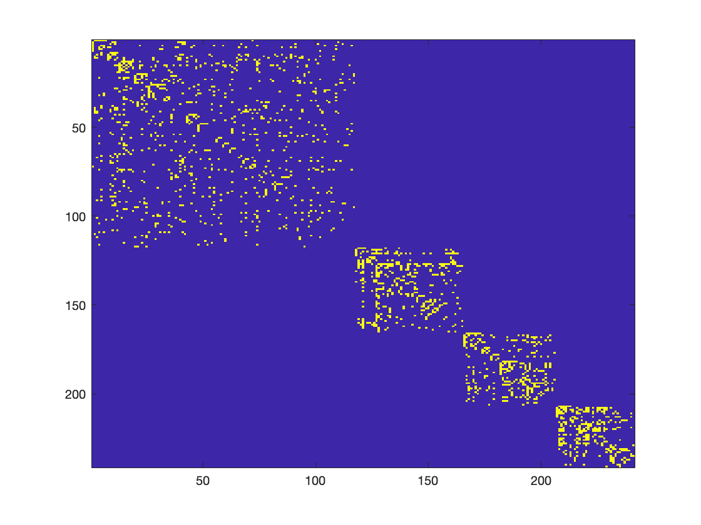
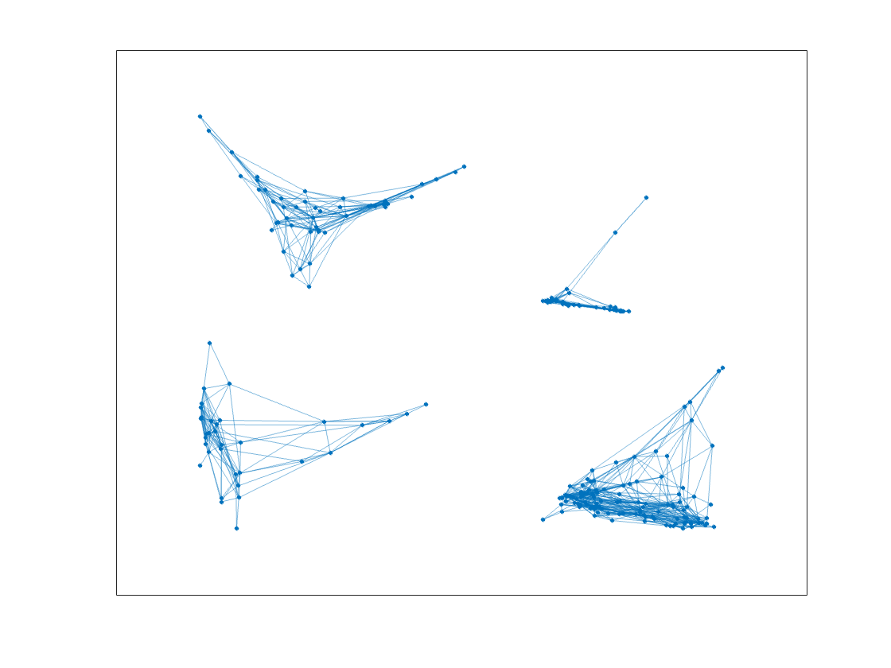
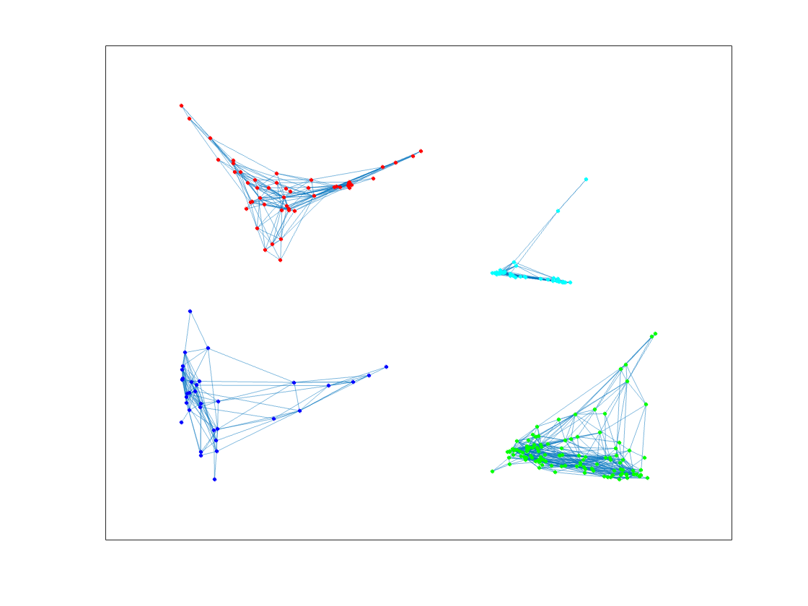
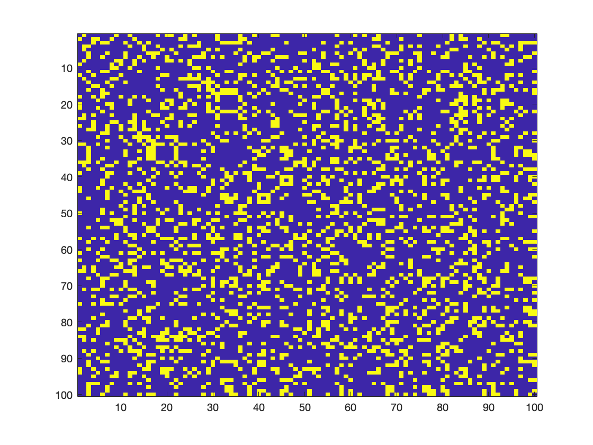
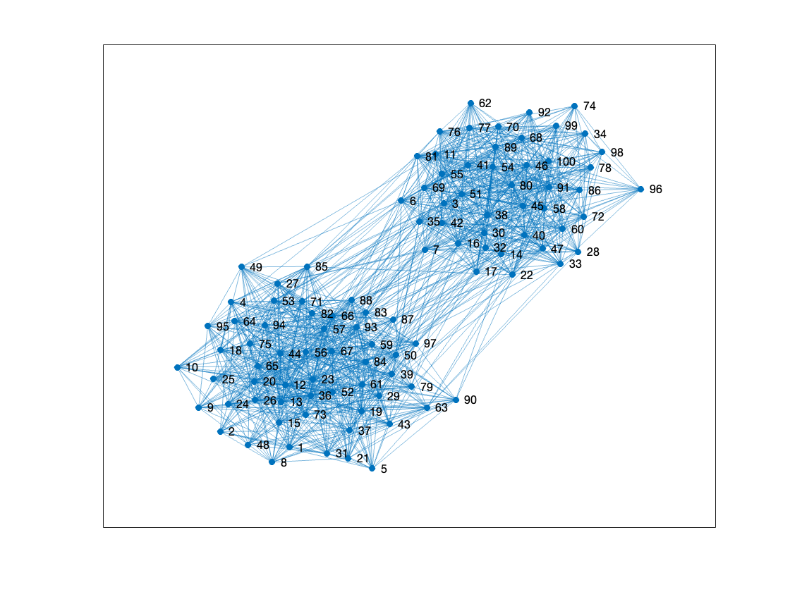
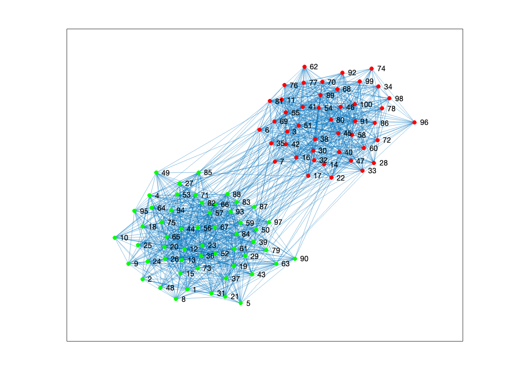
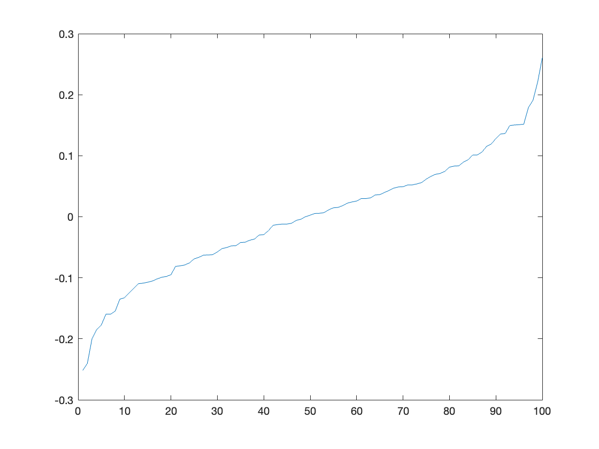

# Spectral Graph Clustering with K-eigenvector Algorithm

Authors: Brando Chiminelli, Tommaso Praturlon

The goal of this work is to implement a spectral graph clustering algorithm as the one described by the research of [Ng, Jordan and Weiss](http://ai.stanford.edu/~ang/papers/nips01-spectral.pdf) using MATLAB and its Statistics and Machine Learning toolbox. Given a graph, described as a series of edges (u,v) in a .csv file, we want to discover how many communities are present. Firstly, we work on a dataset prepared by Ronald Burt, extracted from the 1966 data collected by the research of [Coleman, Katz, and Menzel](https://www.jstor.org/stable/10.1086/320819?seq=1#metadata_info_tab_contents) on medical innovation and how information about the marketing of a drug spread. They collected data from physicians in four towns in the US: Peoria, Bloomington, Quincy, and Galesburg, clustered as 1, 2, 3, and 4, respectively. Secondly, we worked on a synthetic graph to further test our implementation.

The basic idea behind the algorithm is to depart from the standard clustering approach based on generative models and use spectral clustering instead. Generative models such as k-means or Expectation Maximization (EM), use Bayes' inference rule to calculate joint probabilities to maximise the likelihood that an element belongs to a group. These have some drawbacks such as the need to run multiple times to find global minima, and the assumption that the density of each cluster is Gaussian. On the other hand, spectral clustering exploits some generative models applied on special eigenvectors derived from the manipulated data, instead of directly on data. This approach gives more satisfactory results as it can be seen in the pictures below, which are taken from Ng et al. research.

| Applying k-means directly to the dataset | Applying k-means after the algorithm implementation |
| :---: | :---: |
|  |  |

## Implementation

For our implementation we used MATLAB and exploited its functions from the Statistics and Machine Learning Toolbox, e.g. `kmeans()`.
The code is in src/spectral_clustering.m folder.

### First Graph

The algoritm in the paper starts by creating the affinity matrix A, storing the affinity for each element compared to all others, computed as distance. As we already have our vertices and edges, we don't need to compute iteratively their distances, instead, since they are numbered edges, we can cast them in a matrix and set A(i,j) to 1 if elements i and j are connected, 0 otherwise. This operation is done by MATLAB with `sparse()`, and then `full()` to obtain the Affinity matrix A.

When displayed, the matrix clearly shows four clusters, identified as close items. This matrix is then fed to `graph()` to display the draph in the table below.

```
E = readmatrix('../data/example1.dat');
E = unique(E, "rows"); % Get the unique edge, no duplicates
vertex1 = E(:,1);
vertex2 = E(:,2);
max_ids = max(max(vertex1,vertex2)); % Get total number of vertices
As = sparse(vertex1, vertex2, 1, max_ids, max_ids); % Computation of the adjacency matrix
A = full(As); % Not to have a sparse matrix
G = graph (As);
```
| Affinity matrix | Graph |
| :---: | :---: |
|  |  |


From the picture we deduce that there are actually four clusters as intended, thus we set our `K=4` to run the algorithm with k-means.
At this point, we derive the Laplacian and, most importantly, its eigenvectors. This matrix is a normalized representation of the extent to which the vertices of the graph differ from their neighbors.

```
K=4; % Number of clusters (deduced from the graph)
D = diag(sum(A,2)); % Diagonal matrix algorithm
L = D^(-1/2)*A*D^(-1/2); % Laplacian matrix
[Vl,Dl] = eig(L); % Get eigenvectors and eigenvalues of L
```
The eigenvectors of L are used to compute the Fiedler vector, corresponding to the second smallest eigenvalue of the Laplacian matrix and returning a representation of the transition between clusters.

Secondly, we compute _Y_ by normalizing the matrix _X_ with k largest eigenvectors. By applying the function `kmeans()` we obrain a column vector of indeces numbered 1 to 4, representing element in row _i_ belonging to a specific cluster. The result is then plotted in the figure below.

```
fiedlerVec = Vl(:,2); 
sorted_fielderVec = sort(fiedlerVec);
figure;
plot(sorted_fielderVec) % Display Fiedler vector

[VK,DK] = eigs(L,K,'largestreal'); % Get the K largest eigenvectors of L
D = diag(DK); 
X = VK; % X is the matrix of the K largest eigenvectors

denom  =(sum( X.^2,2)).^(1/2);
Y = bsxfun(@rdivide,X,denom); % Normalize X

idx = kmeans(Y,K); % Apply k-means to cluster the graph into K clusters

figure;
h = plot(G, "MarkerSize", 6);
highlight(h,find(idx==1),'NodeColor','magenta')
highlight(h,find(idx==2),'NodeColor','red')
highlight(h,find(idx==3),'NodeColor','blue')
highlight(h,find(idx==4),'NodeColor','green')
```

| Clustered graph | Fiedler vector |
| :---: | :---: |
|  |  |

### Second Graph

For the second, synthetic graph, the operations are the same of the algorithm above, except that we change K to 2 and the dataset.

```
E = readmatrix('../data/example2.dat');
K=2; % Number of clusters (deduced from the graph)
```

| Affinity matrix | Graph |
| :---: | :---: |
|  |  |

| Clustered graph | Fiedler vector |
| :---: | :---: |
|  |  |
