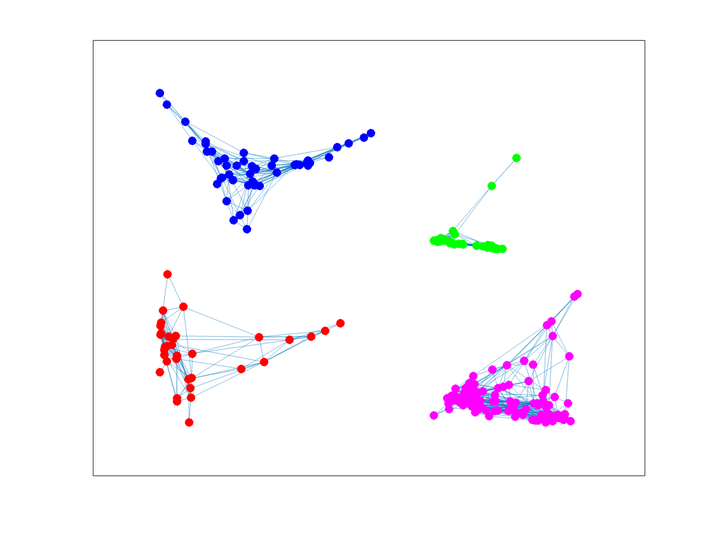
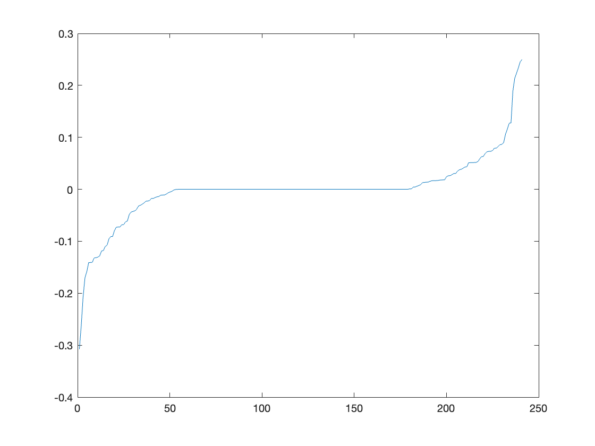

# Spectral Graph Clustering with K-eigenvector Algorithm

Authors: Brando Chiminelli, Tommaso Praturlon

The goal of this work is to implement a spectral graph clustering algorithm as the one described by the research of [Ng, Jordan and Weiss](http://ai.stanford.edu/~ang/papers/nips01-spectral.pdf) using MATLAB and its Statistics and Machine Learning toolbox. Given a graph, described as a series of edges (u,v) in a .csv file, we want to discover how many communities are present. Firstly, we work on a dataset prepared by Ronald Burt, extracted from the 1966 data collected by the research of [Coleman, Katz, and Menzel](https://www.jstor.org/stable/10.1086/320819?seq=1#metadata_info_tab_contents) on medical innovation and how information about the marketing of a drug spread. They collected data from physicians in four towns in the US: Peoria, Bloomington, Quincy, and Galesburg, clustered as 1, 2, 3, and 4, respectively. Secondly, we worked on a synthetic graph to further test our implementation.

The basic idea behind the algorithm is to depart from the standard clustering approach based on generative models and use spectral clustering instead. Generative models such as k-means or Expectation Maximization (EM), use Bayes' inference rule to calculate joint probabilities to maximise the likelihood that an element belongs to a group. These have some drawbacks such as the need to run multiple times to find global minima, and the assumption that the density of each cluster is Gaussian. On the other hand, spectral clustering exploits some generative models applied on special eigenvectors derived from the manipulated data, instead of directly on data. This approach gives more satisfactory results as it can be seen in the pictures below, which are taken from Ng et al. research.

| Applying k-means directly to the dataset | Applying k-means after the algorithm implementation |
| :---: | :---: |
|  |  |

## Implementation

For our implementation we used MATLAB and exploited its functions from the Statistics and Machine Learning Toolbox, e.g. `kmeans()`.
The code is 

### First Graph

Start by reading the data and creating the affinity matrix A.

```
E = readmatrix('../data/example1.dat');
E = unique(E, "rows"); % Get the unique edge, no duplicates

vertex1 = E(:,1);
vertex2 = E(:,2);
max_ids = max(max(vertex1,vertex2)); % Get total number of vertices
As = sparse(vertex1, vertex2, 1, max_ids, max_ids); % Computation of the adjacency matrix

G = graph (As);
```
| Affinity matrix | Graph |
| :---: | :---: |
|  |  |


From the picture we deduce that there are actually four clusters as intended, thus we set our `K=4` to run the algorithm with k-means.
What is Laplacian.
What are eigenvectors.

```
K=4; % Number of clusters (deduced from the graph)

A = full(As); % Not to have a sparse matrix
D = diag(sum(A,2)); % Diagonal matrix algorithm
L = D^(-1/2)*A*D^(-1/2); % Laplacian matrix
[Vl,Dl] = eig(L); % Get eigenvectors and eigenvalues of L
```

```
code
```

| Clustered graph | Fiedler vector |
| :---: | :---: |
|  |  |

### Second Graph

Change K to 2 and dataset.

```
E = readmatrix('../data/example2.dat');
K=2; % Number of clusters (deduced from the graph)
```


